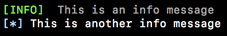
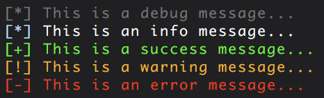
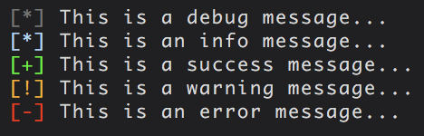
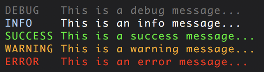
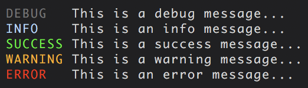
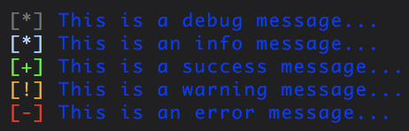
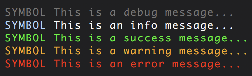
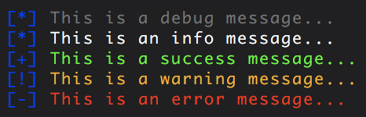
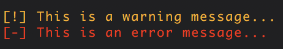

# Description

A simple, lightweight, customizable cli logger that writes to stdout and stderr.

It has 5 different message levels:

  * debug (stdout)
  * info (stdout)
  * success (stdout)
  * warning (stderr)
  * error (stderr)

# Installation

### Local

```npm install --save logger-md```

### Global

```[sudo] npm install --global logger-md```

# Usage

```javascript
  const log = require('logger-md');
  
  log.debug(`This is a debug message`);
  log.info(`This is an info message`);
  log.success(`This is a success message`);
  log.warning(`This is a warning message`);
  log.error(`This is an error message`);
  
```


# Customization

Note: The functions that take a color argument need to be given a hex color value.

```javascript
  const log = require('logger-md');
  
  log.info.update.symbol('[INFO]\t');
  log.info.update.symbol.color('#00ff00');
  log.info.update.message.color('#999999');
  
  log.info('This is an info message');
  
  log.info.reset();
  
  log.info('This is another info message');
```



# Convenience Functions

## log.reset()

Resets symbols, message and symbol colors, and log level to their default values.



## log.preset_#()

Shortcut to accessing some preset styles.

#### log.preset_1() [default]


#### log.preset_2()



#### log.preset_3()



#### log.preset_4()



## log.update.message.color(color)

Sets the same message color for ALL message levels.

```javascript
  log.update.message.color('#0000ff');
```



## log.update.symbol(symbol)

Sets the same symbol for ALL message levels.

```javascript
  log.update.symbol('SYMBOL ');
```



## log.update.symbol.color(color)

Sets the same symbol color for ALL message levels.

```javascript
  log.update.symbol.color('#0000ff');
```



## log.update.level(level)

Displays all messages above the set log level. The levels start from DEBUG(0) and go up to ERROR(5). The enums for the level can be accessed with:

  - log.DEBUG
  - log.INFO
  - log.SUCCESS
  - log.WARNING
  - log.ERROR
  
```javascript
  log.update.level(log.WARNING);
```



# License

[ISC](https://spdx.org/licenses/ISC)