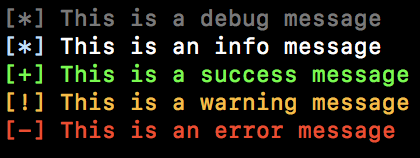

## Description

A simple cli logger that writes to stdout.

It has 5 different message levels:

  * debug
  * info
  * success
  * warning
  * error

## Installation

```npm install --save logger-md```

## Usage

### Code

```javascript
  const log = require('logger-md');
  
  log.debug(`This is a debug message`);
  log.info(`This is an info message`);
  log.success(`This is a success message`);
  log.warning(`This is a warning message`);
  log.error(`This is an error message`);
  
```

### Output



## License

[ISC](https://spdx.org/licenses/ISC)